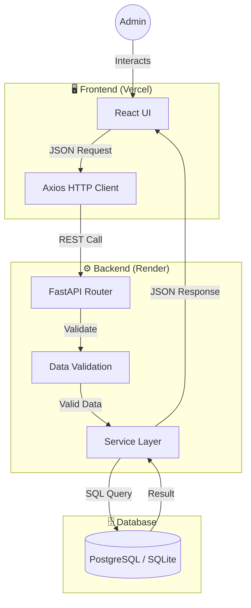
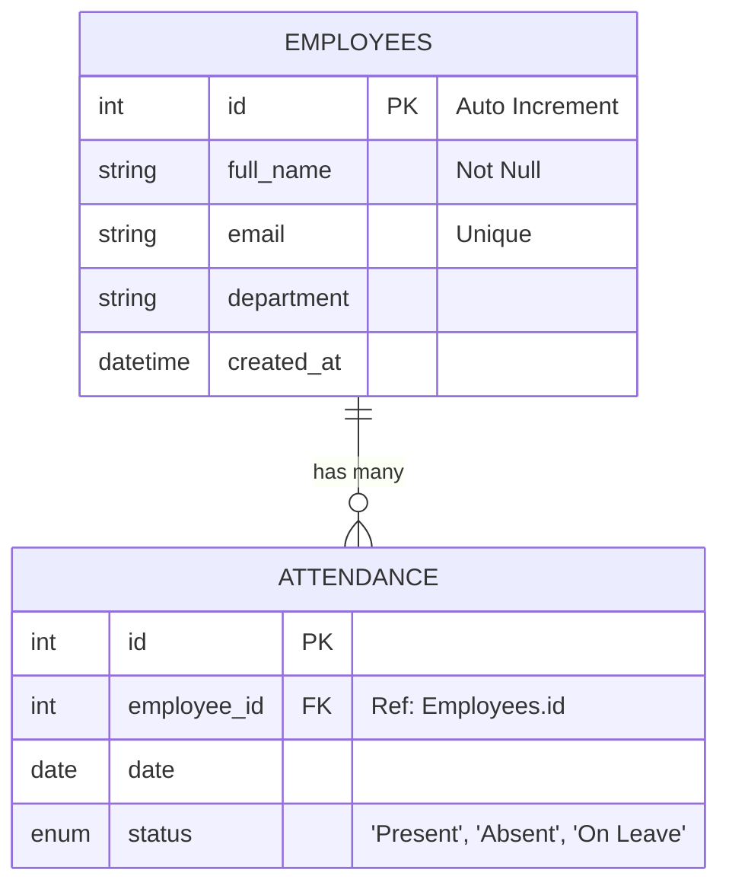

# HRMS Lite ✅

**A lightweight, full-stack Human Resource Management System.** *Streamlining employee records and daily attendance tracking.*

Developed by [Deepayan Thakur](https://github.com/Deepayan-Thakur). 👈🏻

<div align="center">

---

## 🔗 Live Deployment

| Service | Status | Link |
| :---: | :---: | :---: |
| **Frontend** | 🟢 Live | [Frontend](https://hrms-lite-teal.vercel.app/) |
| **Backend API** | 🟢 Live | [Backend](https://hrms-lite-foz6.onrender.com/docs) |
| **Repository** | 🐙 GitHub | [This Repository](https://github.com/Deepayan-Thakur/hrms-lite) |

---

</div>


## 📖 Project Overview

**HRMS Lite** is a production-ready web application designed to simulate essential internal HR operations. It provides a single-admin interface to manage employee directories and track daily attendance status efficiently.

**Key Objectives:**
* **Centralized Data:** Manage employee records (Add, View, Delete) in one place.
* **Attendance Tracking:** Log daily presence (Present, Absent, On Leave).
* **Clean UX:** A professional, responsive interface with real-time feedback.

---

## 🏗 System Architecture (Canvas)

### 1. High-Level Data Flow
This diagram illustrates how data flows from the Admin's interaction down to the database persistence layer.



### 2. Database Schema (ER Diagram)

The system uses a relational model enforcing strict referential integrity between Employees and their Attendance logs.



---
<div align="center">

## 🛠 Tech Stack

| Category | Technology | Purpose |
| --- | --- | --- |
| **Frontend** | React + Vite | Fast, component-based UI |
| **Styling** | Tailwind CSS | Responsive, utility-first design |
| **Backend** | FastAPI (Python) | High-performance, async API |
| **Database** | PostgreSQL | Robust production data storage |
| **ORM** | SQLAlchemy | Pythonic database interactions |
| **Validation** | Pydantic | Strict data parsing and validation |

</div>

---

<div align="center">

## 📡 API Reference

### 👤 Employee Management

| Method | Endpoint | Description | Payload Example |
| --- | --- | --- | --- |
| `GET` | `/employees` | List all staff | N/A |
| `POST` | `/employees` | Add new staff | `{ "full_name": "Deepayan Thakur", "email": "deepayan@example.com", "department": "Engineering" }` |
| `DELETE` | `/employees/{id}` | Remove staff | N/A |

### 📅 Attendance Management

| Method | Endpoint | Description | Payload Example |
| --- | --- | --- | --- |
| `GET` | `/attendance` | View all logs | N/A |
| `POST` | `/attendance` | Mark status | `{ "employee_id": 1, "date": "2026-02-06", "status": "Present" }` |
| `GET` | `/attendance/{id}` | History by ID | N/A |
</div>

---

## 🚀 Local Setup Guide

Follow these steps to deploy the "Canvas" locally.

### 1. Clone & Configure

```bash
git clone [https://github.com/your-username/hrms-lite.git](https://github.com/your-username/hrms-lite.git)
cd hrms-lite

```

### 2. Backend Initialization

```bash
cd backend
python -m venv venv
# Windows: venv\Scripts\activate | Mac/Linux: source venv/bin/activate
source venv/bin/activate  
pip install -r requirements.txt
uvicorn main:app --reload

```

### 3. Frontend Initialization

```bash
cd ../frontend
npm install
npm run dev

```

---

## ⚠️ Assumptions & Constraints

* **Authentication:** The system assumes a single Admin user; no login mechanism is implemented (per assignment scope).
* **Scalability:** Designed for "Lite" usage; pagination is not implemented for lists under 100 records.
* **Timezone:** All dates are stored in UTC but displayed in the browser's local time.

---

## 👨‍💻 Author

**Deepayan Thakur**
Frontend Engineer | Machine Learning Engineer | Python Developer

🔗 GitHub: [https://github.com/Deepayan-Thakur](https://github.com/Deepayan-Thakur)

🌐 Portfolio: [https://deepayan-thakur-portfolio.vercel.app/](https://deepayan-thakur-portfolio.vercel.app/)

---
